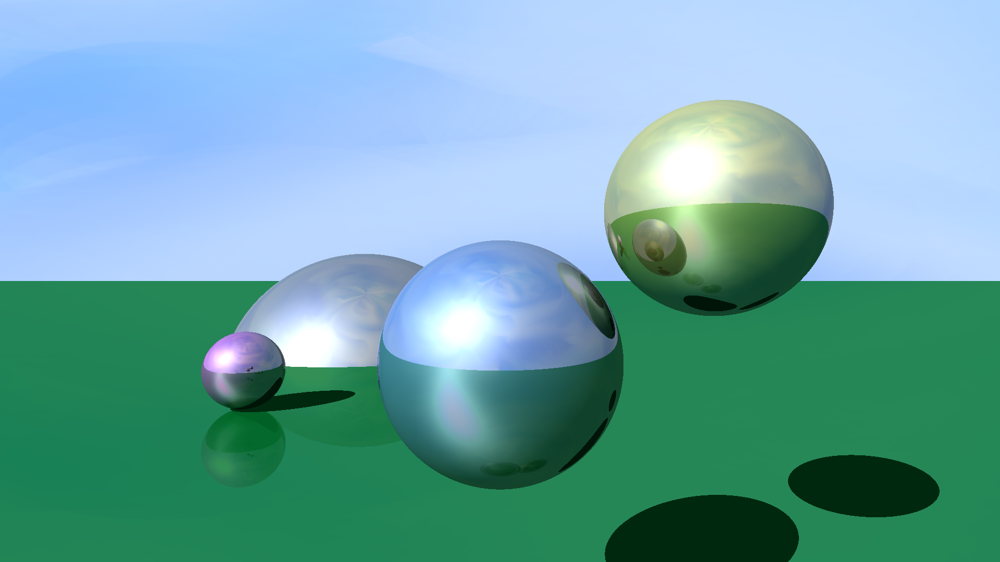

# Path Tracer

Shoots rays at a scene of planes and spheres. Calculates distance,
intersection point, normal. Uses these to compute a Blinn-Phong lighting
with per pixel accuracy. Traces another ray for shadow and reflection.

Outputs a .bmp image

## Sample

## Compiling

Requires GLM library to be put in this directory. Then run "make".

Get GLM from here:

https://glm.g-truc.net/0.9.9/index.html
